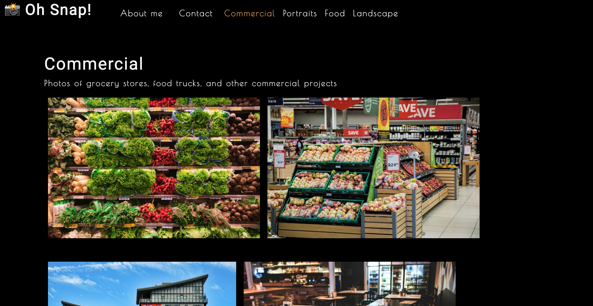

# Photo Port

## Description
Photography portfolio displaying sample photos of commercial businesses, portraits, food, and landscapes.

## License  
This application is covered under the following license. Please review the link below for additional information pertaining to the license.
    
  
https://www.gnu.org/licenses/gpl-3.0

## Table of Contents
[Deployed Application](#deployed-application)  
[Built With](#built-with)  
[Landing Page](#landing-page)  
[Installation](#installation)  
[Testing](#testing)  
[Contribution](#contribution) 

## Deployed Application
http://dylanhay.github.io/photo-port-react

## Built With
* React.js
* Node.js
* JavaScript
* HTML
* CSS
* Jest
* GitHub Pages

## Landing Page

## Installation  
To run locally once cloned:
* Enter `npm install` in the CLI to install the required npm packages
* Enter `npm start` in the CLI to launch the application

## Testing  

## Contribution
Built by Dylan Hay